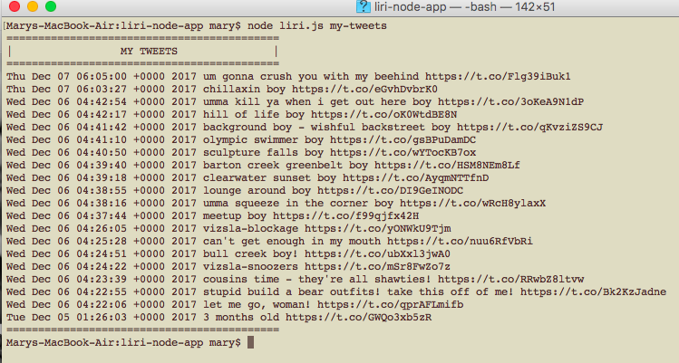
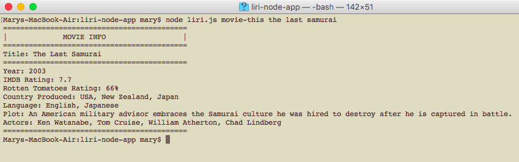
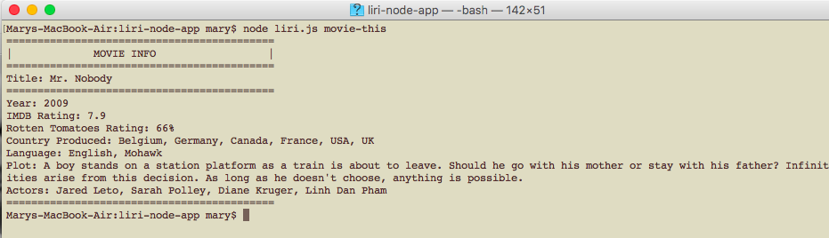
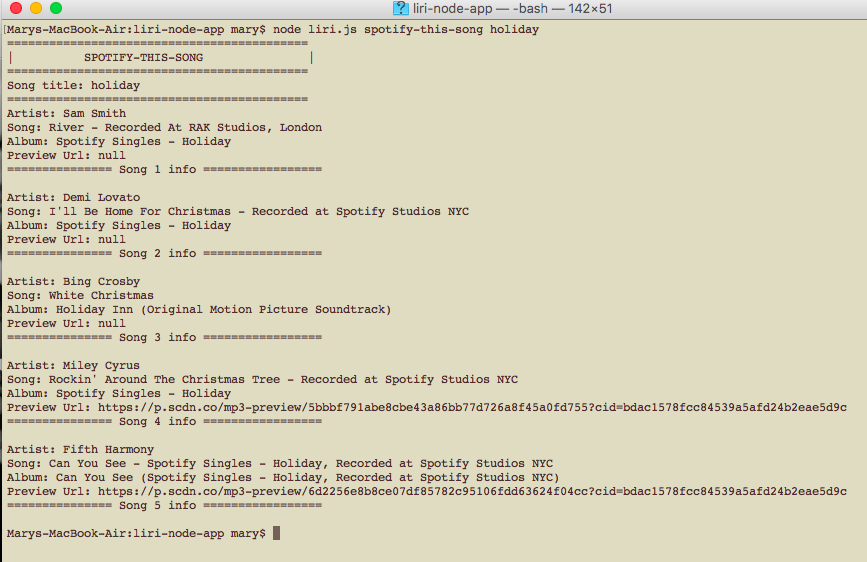
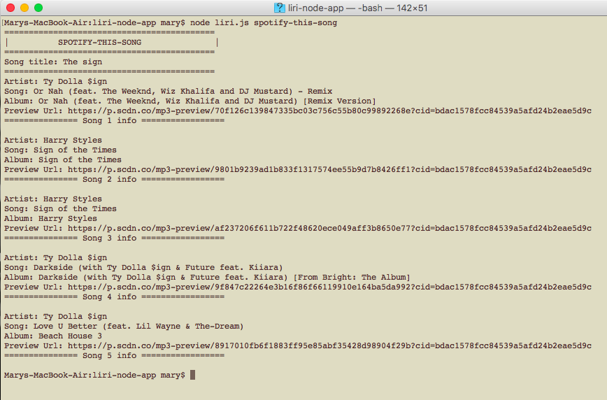
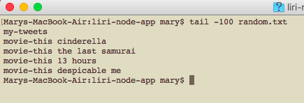
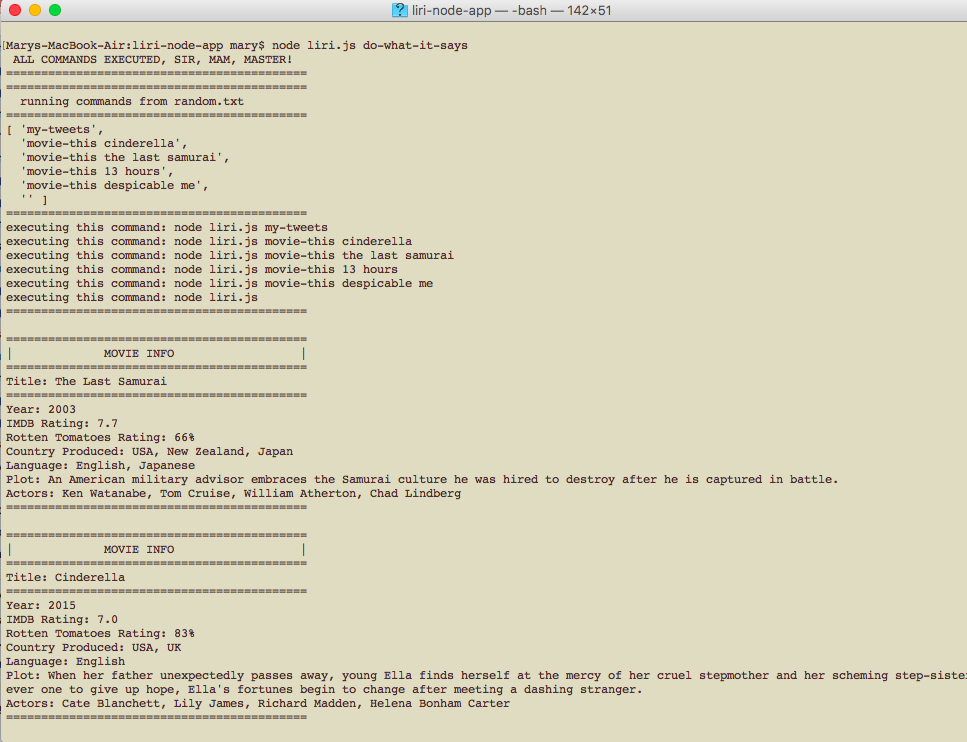
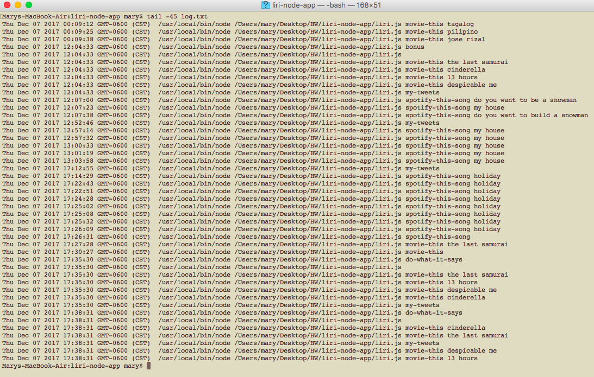

# liri-node-app

this is a node application which uses spotify, twitter and MDB APIs as a selection for the user to query.

the script takes in arguments and shows you the information upon that arguments

my-tweets (shows the 20 most recent tweets)
movie-this [movie-name] (shows the info of that movie name)
spotify-this-song [song] (shows info for the song provided)

My tweets:

movie-this [title]

movie-this [ no title]

spotify-this [title]

spotify-this [ no title]

Do what it says (random.txt)
random.txt shows the lines of codes that needed to be automatically executed

passing the "do-what-it-says" argument will execute what is in random.txt

and it logs everything the program has been run

